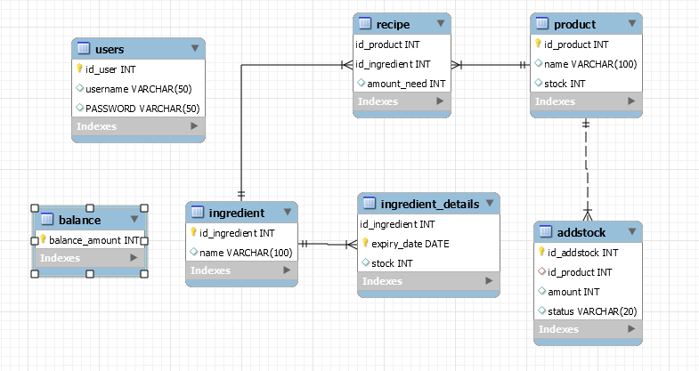

# Tugas Besar 2 IF3110 Pembelajaran Aplikasi Berbasis Web
# WS-Factory

## Deskripsi Web Service
Web Service Factory diimplementasikan di atas Node.js dengan mengimplementasikan Java Servlet menggunakan JAX-WS dengan protokol SOAP. Web service ini digunakan untuk Willy Wangky's Factory dan Willy Wangky’s Web.

Layanan yang disediakan:
1. Menambahkan jenis coklat baru beserta resep (kebutuhan bahan) dan harganya.
2. Menambahkan permintaan add stock baru.
3. Mengembalikan status dari permintaan add stock.
4. Melakukan pembuatan coklat tertentu dengan jumlah tertentu, yaitu mengubah bahan tidak kedaluwarsa dalam stok gudang Factory menjadi coklat (yang masih berada dalam gudang Factory) dan mengurangi bahan dalam gudang apabila bahan cukup.
5. Mengubah status permintaan add stock, dalam artian melakukan pengiriman terhadap toko Willy Wangky.
6. Menambah saldo pada Factory.
7. Mengembalikan saldo yang dimiliki pada Factory.
8. Menambahkan bahan dalam gudang.

## Basis data

 
### Tabel

| Nomor | Relasi             | Penjelasan                                                                                                                                                             |
|-------|--------------------|------------------------------------------------------------------------------------------------------------------------------------------------------------------------|
| 1     | addstock           | Relasi ini berisi data permintaan add stock yang terdiri atas ID permintaan add stock, ID produk coklat, jumlah yang diminta, dan status permintaan(Pending/Delivered) |
| 2     | balance            | Relasi ini berisi data saldo factory.                                                                                                                                  |
| 3     | ingredient         | Relasi ini berisi data bahan yang dimiliki factory yang terdiri atas ID dan nama bahan.                                                                                |
| 4     | ingredient_details | Relasi ini berisi informasi lebih jauh dari bahan yang dimiliki factory yang terdiri atas ID bahan, tanggal kadaluwarsa, dan stoknya.                                  |
| 5     | product            | Relasi ini berisi data produk coklat yang dimiliki yang terdiri atas ID coklat, nama coklat, dan stoknya.                                                              |
| 6     | recipe             | Relasi ini berisi data resep coklat yang terdiri atas ID coklat, ID bahan yang diperlukan untuk pembuatan, dan banyaknya bahan yang dibutuhkan.                        |
| 7     | users              | Relasi ini berisi data akun pengguna yang terdiri atas ID user, username, dan password.

                                                                          |